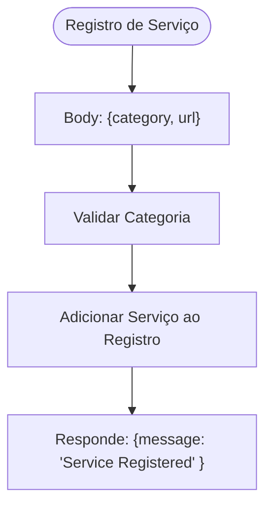
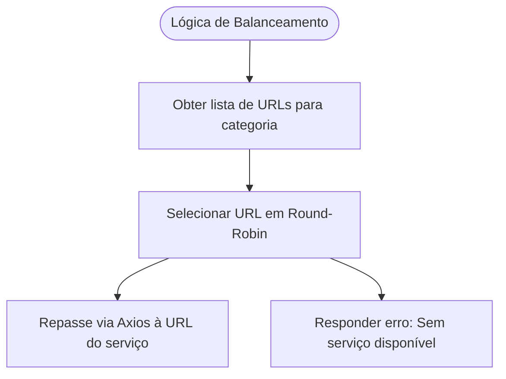
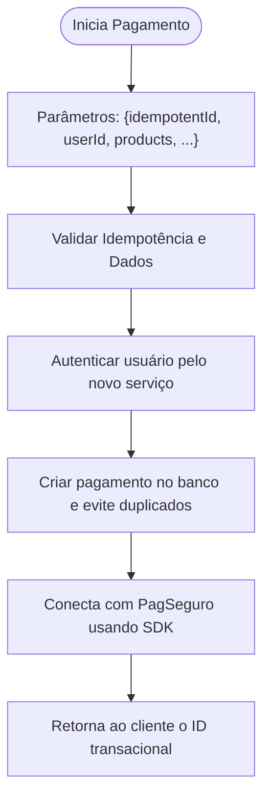
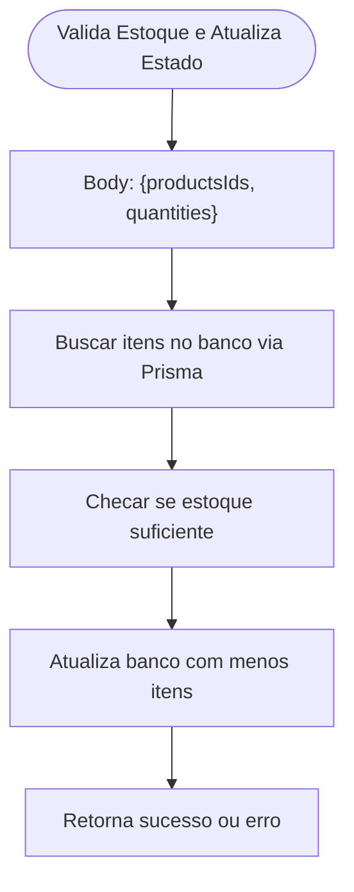
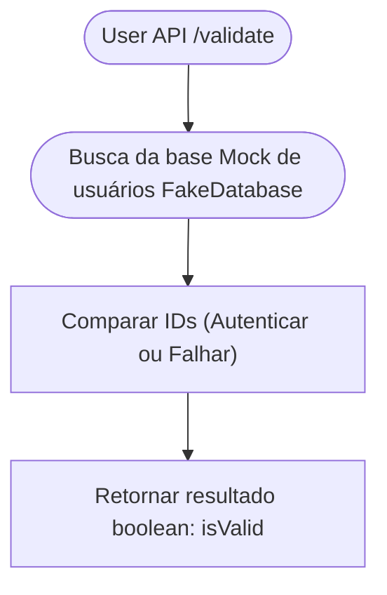

### Especificação Funcional e Análise Técnica do Código

A seguir, uma especificação funcional detalhada do sistema com base no código recebido.

---

### **Visão Geral do Sistema**

Este sistema implementa um conjunto de microsserviços para uma aplicação composta. Os microsserviços desempenham funções específicas de acordo com suas categorias: gateway (roteamento central), pagamentos (processamento de pagamentos com Mercado Pago/PagSeguro), produtos (gerenciamento de inventário) e usuários (validar credenciais e IDs). Além disso, há uma API de descoberta, responsável por registrar os serviços disponíveis e possibilitar comunicação inter-serviços via balanceamento de carga.

---

### **1. Gateway API**

- **Objetivo:**  
    O sistema Gateway (API Gateway) centraliza o acesso aos serviços disponíveis, incluindo balanceamento de carga simples entre as URLs de serviços registrados.

- **Principais Funcionalidades:**  
  - Registrar serviços via `/register`.
  - Recuperar todos os serviços registrados `/services`.
  - Buscar serviços por categoria `/services/:category`.
  - Balancear requisições de forma simples por índices circulares.
  - Proxiar requisições inbound para o serviço adequado usando headers autorizados.

- **Fluxos Implementados:**  
  - **Registrar Serviço**:  
    Endpoint: `/register` (POST). Recebe `category` e `url` no corpo e adiciona à lista de serviços registrados.
  - **Excluir Serviço**:  
    Endpoint: `/register` (DELETE). Remove o serviço e ajusta índice de balanceamento.
  - **Retornar Todos os Serviços**:  
    Endpoint: `/services` (GET). Retorna JSON com todas as URLs registradas.
  - **Roteamento de Requisição**:  
    Proxy genérico com endpoint `/:category/*` (qualquer rota), que repassa a requisição segundo a lógica de balanceamento.

---

### **Diagramas do Gateway**

#### Diagrama: Registro de Serviço

#### Diagrama: Balanceamento de Carga

---

### **2. Payment API**

- **Objetivo:**  
    Este microsserviço é responsável por processar pagamentos usando estratégias como validação idempotente e lógica de transações.

- **Principais Funcionalidades:**  
  - Criar novos pagamentos (`start-payment`) com validação de usuário e produtos.
  - Processar notificações ou atualizações (`notify`), principalmente sobre status de pagamentos.
  - Autenticação básica como decorador.
  - Interação com outros serviços através da API de descoberta.

- **Fluxos Implementados:**  
  - **Iniciar Pagamento**:  
    Endpoint `/start-payment` (POST). Valida usuários e itens de compra, cria registro idempotente e efetua chamada à API de pagamento.
  - **Notificar Status**:  
    Endpoint `/notify` (POST). Genérico para receber notificações de completude ou falhas do fluxo de pagamento.
  - **Autenticação Básica**:  
    Decorador `BasicAuthDecorator`, responsável pela autenticação via header com credenciais base64.

---

### **Diagramas da PagSeguroAPI**

#### Diagrama: Processo de Pagamento

---

### **3. Product API**

- **Objetivo:**  
    A Product API gerencia estoque, valida quantidade de produtos em transação e atualiza estado do inventário durante pagamentos ou alterações fora do fluxo.

- **Principais Funcionalidades:**  
  - Criar e atualizar informações sobre produtos (criação de inventário).
  - Permanecer como serviço registrável via API de descoberta.
  - Validar a disponibilidade de produtos para uma transação.

---

#### Diagrama: Validação de Estoque

---

### **4. User API**

- **Objetivo:**  
    Serviço de usuários cumpre basicamente funções de validação de credenciais e IDs fornecidos.

- **Principais Funcionalidades:**  
  - Validar IDs de usuários registrados (ex.: em fluxos de pagamento).
  - Tratar credenciais de acesso via Autenticação Básica.

---

#### Diagrama: Validação do Usuário

---

### **Resumo dos Fluxos de Comunicação**

#### Microsserviços e Comunicação
- `Gateway`: Coordena e balanceia serviços.
- `Payments API`: Gerencia transações e interage com PagSeguro.
- `Product API`: Gerencia inventário e validações.
- `User API`: Valida usuários e credenciais.
  
#### Serviços Externos
- **PagSeguro / Mercado Pago** para transações de pagamento realizadas online.

#### Comunicação entre Microsserviços
- **API de Descoberta**: `/services/:category` permite comunicação inter-módulos.

---

### **Considerações Finais**

**Pontos Fortes do Sistema:**  
- Sistema modular e escalável com microsserviços utilizando balanceamento de carga.
- Presença de APIs bem segmentadas por responsabilidades específicas (gateway, discovery, etc.).
- Uso de interfaces e DTOs para validar dados e gerenciar contratos de entrada.

**Sugestões de Melhorias:**  
- Implementar lógica robusta de controle de erros e timeouts para melhorar a resiliência entre APIs.
- Criar testes unitários para todos os módulos e integrar automação de deploy para monitoramento contínuo.
  
Se necessário, os fluxos podem ser detalhados ou visualizados com diagrams específicos!