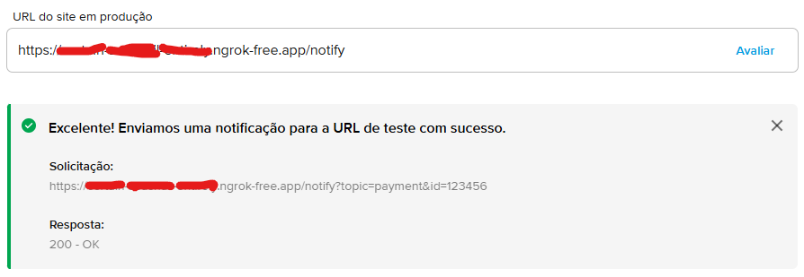

# Serviços

- Product (implementa 3 casos de uso)
- User (autenticação e valição)
- Payment (implementa 1 caso de uso)
- Discovery + Gateway + LoadBalancing
- NGROK (redirecionador de requisições externas)

# Preparação para rodar

- Baixar o Insomnia e carregar o arquivo `Insomnia_requisicoes.json` nele (provavelmente precisa criar um coleção e carregar ele dentro dessa coleção de requisições vazia).
- Usar [esse link](https://it-tools.tech/uuid-generator) para gerar UUIDV4 facilmente

# Como executar conteneirizado

1. Abra o Docker Desktop e preencha as variáveis de ambiente de acordo com .env.example
2. Execute
    ```bash
    docker-compose up --build
    ```

# Como executar no terminal (alternativa sem conteneirizar tudo)
Observação: o serviço de Discovery deve ser executado primeiro ou dentro de 30 segundos para que os outros serviços não desistam de se registrar.

1. Abra o Docker Desktop e preencha as variáveis de ambiente de acordo com .env.example (utilize localhost em vez de nome de container onde necessário)
2. Execute o postgress sozinho:
    ```bash
        docker-compose -f docker-compose-only-db.yml up --build
    ```
3. Execute em cada serviço.
    ```bash
    npm i
    npx prisma generate
    npx prisma migrate dev --name init
    npm run dev
    ```
4. Testar o NGROK recebendo notificações
    - Criar uma conta e um domínio gratúido [nesse site](https://ngrok.com/)
    - Criar uma conta no Mercado Pago e criar uma **integração com CheckoutBricks**
    - Baixar o NGROK com chocolatey (gerenciador de pacotes) ou com `npm i ngrok`
    - Iniciar o NGROK com (`npx`) `ngrok http --domain=seu-dominio-free.ngrok-free.app 8080`
    - Iniciar server.js para escutar 8080 e esperar a notificação do Mercado Pago
    - [entrar nesse link do Mercado Pago](https://www.mercadopago.com.br/developers/panel/app/1475325203058953/ipn)
    - Colocar o domínio recebido aleatoriamente pelo NGROK no link do Mercado pago (acrescente `"/notify"` no fim do link)
    - Clique no botão *avaliar*. O resultado deve ser status 200 OK.
    

